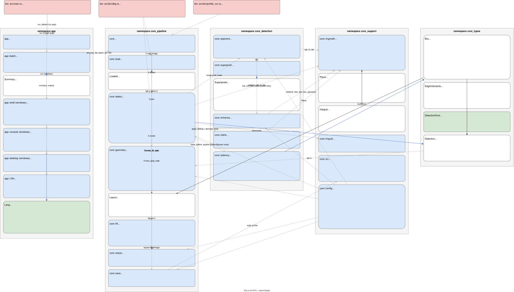
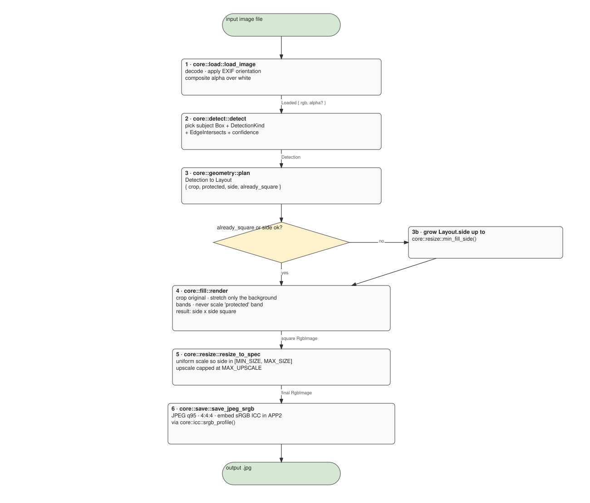
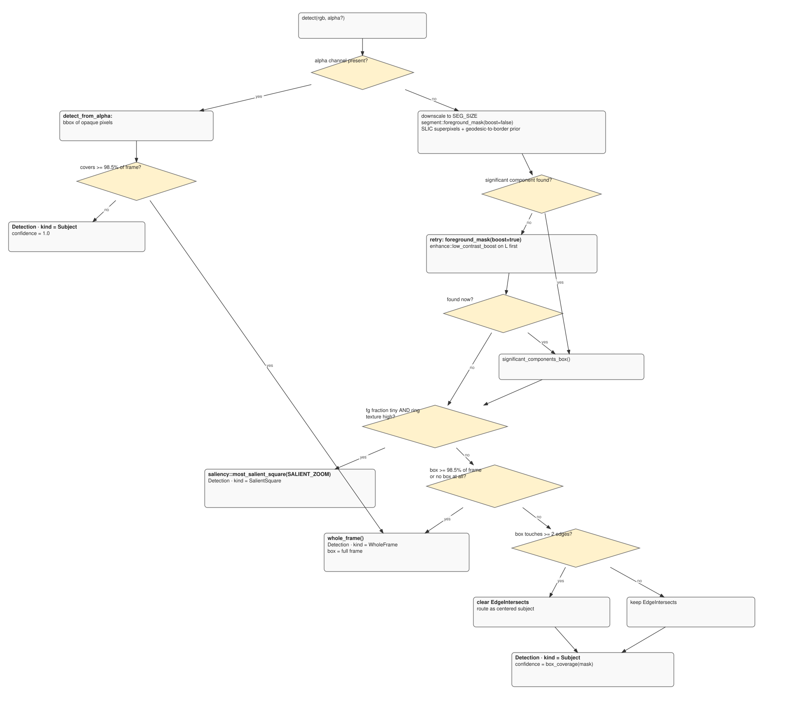
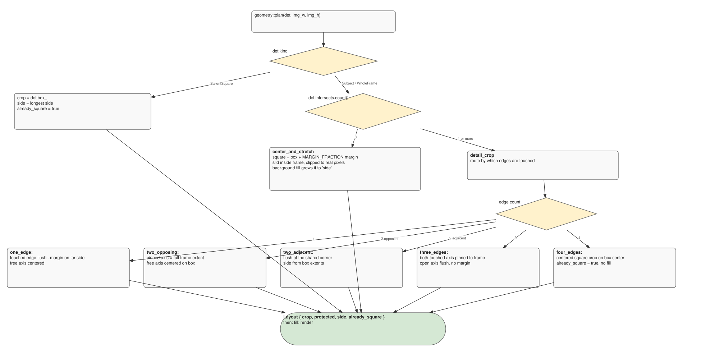

# CSP architecture

UML-style map of every module, its types, its public surface, and how data flows through the
pipeline. Four diagrams, each with one job:

1. **Class map** — all modules + structs/enums, fields, methods, and their dependency edges.
2. **Pipeline flow** — the six stages, the object handed between them, the branch points.
3. **Detection internals** — how `detect()` picks a box.
4. **Geometry routing** — how `plan()` turns a `Detection` into a `Layout`.

**Maintenance rule:** one node per module, one node per `struct`/`enum`. Add a module or a public
function → patch the node in the same commit. A node with no matching file means the diagram drifted.

Legend: `+` public · `-` private · `<<module>>` = Rust module (free functions) · dashed line = calls/uses ·
diamond-ended line = owns (struct field) · solid line = produces.

---

## 1. Class map

---

## 2. Pipeline flow

`core::process_file` (and the instrumented `profile_run`) run these six steps in order.
`app::batch::run` fans this over every image in the input folder with `rayon`; on success the
source file is deleted, on failure it is left in place.

---

## 3. Detection internals — how `detect()` chooses a box

Notes:
- The **live** path is superpixel segmentation (`segment` → `superpixel`). The chroma/texture
  `build_foreground_mask` + `suppress_shadow` code still in `detect` is **dormant** — only
  `debug_mask` / `debug_shadow` call it.
- `enhance::low_contrast_boost` runs **only** on the retry, on frames the first pass missed.

---

## 4. Geometry routing — `plan(Detection)` produces a `Layout`

---

## External crates

| Crate | Used by | For |
|---|---|---|
| `image` | everywhere | decode/encode, `RgbImage` / `GrayImage`, `imageops` (crop, resize, rotate) |
| `imageproc` | `detect` | `morphology::{open,close}`, `region_labelling::connected_components`, `edges::canny` |
| `rustfft` | `saliency` | 2D FFT for spectral-residual saliency |
| `jpeg-encoder` | `save` | JPEG with 4:4:4 sampling + APP2 segment |
| `rayon` | `app::batch` | parallel `for_each` over the input files |
| `windows-sys` | `app::{console,desktop}` | Desktop folder, UI language, console VT mode |
